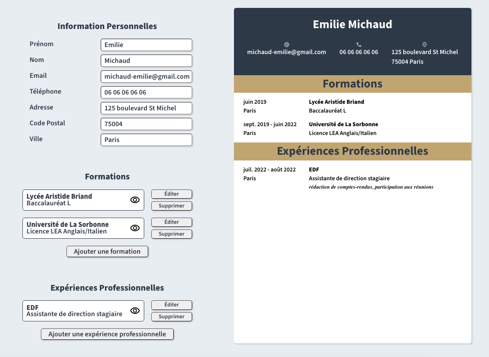

# CV Application - React

A dynamic and interactive CV builder built with **React**. This project was developed as part of the **The Odin Project** curriculum to master state management, form handling, and component architecture.

[live demo](https://evicno-cv-app.netlify.app/)

## Features

Based on the project requirements, this application allows users to:

- **General Information**: Input name, email, phone number and address.
- **Educational Experience**: Add multiple degrees, edit them in real-time, or remove them.
- **Practical Experience**: Add, edit, and delete professional experiences.
- **Interactive Preview**: A live CV preview that updates instantly as you type.
- **Responsive Design**: Optimized for desktop, tablet, and mobile.

## Technologies and concepts used

- **Functional Components & Hooks**: Heavily utilized `useState` for managing complex form data.
- **State Lifting**: Managed the global CV state at the parent level to synchronize the editor and the preview.
- **Dynamic Rendering**

* **Deployment**: Hosted on **Netlify** with continuous deployment.

## Key Challenges & Learnings

The most challenging part was implementing the **in-place editing** functionality. I learned how to:

- Target a specific item using a unique ID (`editingEducId`).
- Temporarily replace a static list item with an active "preview" component in the CV display.
- Debug prop drilling and data structures using **React DevTools**, which was crucial in identifying nested object errors.
